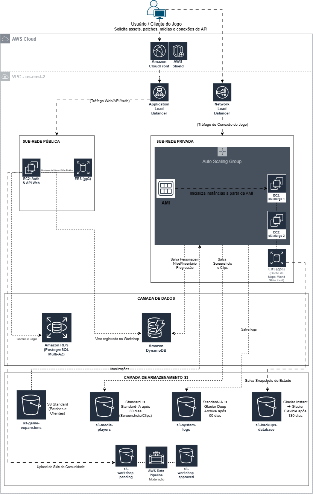

# Arquitetura de Nuvem AWS: Servidor de MMORPG

Este repositório contém a entrega do projeto/desafio de arquitetura do curso 'Gerenciando Instâncias EC2 na AWS' do bootcamp 'GFT - Fundamentos de Cloud com AWS', promovido pela **DIO (DigitalInnovationOne)**. 

O projeto consiste na concepção da infraestrutura em nuvem resiliente, escalável e de alta performance para suportar um jogo eletrônico do tipo **MMORPG (Massively Multiplayer Online Role-Playing Game)** de tema fantasia, hospedado na região **US East - Ohio (`us-east-2`)**.

---

## Diagrama de Arquitetura

O diagrama abaixo descreve a topologia completa da solução, cobrindo desde a borda de rede até a camada de armazenamento persistente:

---

## Detalhamento dos Componentes da Arquitetura

### 1. Borda de Rede & Entrada (Edge Security & Load Balancing)
* **Amazon CloudFront & AWS Shield:** Garante a distribuição de assets estáticos (patches, clientes e mídias) com baixa latência via CDN global e proteção contra ataques DDoS.
* **Application Load Balancer (ALB):** Trata as requisições Web/HTTP/HTTPS para APIs, autenticação e portal do workshop na Sub-rede Pública.
* **Network Load Balancer (NLB):** Responsável por gerenciar o tráfego de alta performance em Camada 4 (TCP/UDP) diretamente com o cliente do jogo na Sub-rede Privada, garantindo baixíssima latência e suporte a milhões de conexões simultâneas de gameplay.

### 2. Camada de Computação e Escala (Sub-redes Pública e Privada)
* **Sub-rede Pública (API & Auth):** Instâncias **Amazon EC2** responsáveis pelo portal web, autenticação de usuários e recepção de uploads de conteúdos da comunidade.
* **Sub-rede Privada (Game Servers):** Conjunto de instâncias EC2 rodando em um **Auto Scaling Group**.
  * **AMI (Amazon Machine Image):** Imagem base customizada contendo a engine e binários do jogo para implantação automatizada de novos servidores em momentos de pico.
  * **EBS (gp3):** Volumes de bloco SSD de alta performance anexados às instâncias para armazenamento do Sistema Operacional e cache temporário do estado do mundo (*world state*).

### 3. Camada de Dados e Persistência
* **Amazon RDS (PostgreSQL - Multi-AZ):** Banco de dados relacional com alta disponibilidade utilizado para dados que exigem forte consistência ACID (contas de usuários, histórico de compras e banlist).
* **Amazon DynamoDB:** Banco NoSQL de baixa latência (esquema chave-valor/documento) para leitura e escrita massiva do progresso contínuo dos jogadores (nível, atributos, conquistas e inventário).

### 4. Camada de Armazenamento S3 & Ciclo de Vida (S3 Lifecycle)
Para otimização de custos e conformidade, foram configuradas políticas de ciclo de vida nos buckets S3:

| Bucket | Finalidade | Regra de Ciclo de Vida (S3 Lifecycle Rule) |
| :--- | :--- | :--- |
| `s3-game-expansions` | Patches, atualizações e cliente do jogo | **S3 Standard** (Download frequente e alta disponibilidade). |
| `s3-media-players` | Screenshots, fotos de perfil e clipes | Transita de **S3 Standard** para **S3 Standard-IA** após 30 dias. |
| `s3-system-logs` | Logs de auditoria, conexões e partidas | Transita de **S3 Standard-IA** para **S3 Glacier Deep Archive** após 90 dias. |
| `s3-backups-database` | Snapshots semanais de EBS e dumps de BD | Transita de **S3 Glacier Instant Retrieval** para **S3 Glacier Flexible** após 180 dias. |
| `s3-workshop-pending` / `s3-workshop-approved` | Pipeline de submissão e aprovação de skins da comunidade | Arquivos recebidos no bucket *pending* passam por votação via API e aprovação de moderadores antes de serem movidos para o bucket *approved*. |

---

## Estimativa de Custos (FinOps & AWS Pricing Calculator)

Com o objetivo de estimar a viabilidade financeira do projeto para uma base estimada de 2.000 jogadores simultâneos (CCU) e 50.000 usuários ativos mensais, foi realizada a modelagem financeira na ferramenta oficial da AWS.

* **Custo Inicial (Upfront):** $180,00 USD *(Capacidade reservada do DynamoDB)*
* **Custo Mensal Estimado:** ~$917,72 USD / mês
* **Custo Anual Projetado:** ~$11.192,64 USD

**[Clique aqui para visualizar a Estimativa Oficial na AWS Calculator](https://calculator.aws/#/estimate?id=e5479b73a6302128de6135b36d370673640567bc)**

### Resumo dos Serviços Estimados:
1. **Amazon EC2:** 4x `c6i.xlarge` com *Compute Savings Plans (3 anos)* + 100 GB EBS (`gp3`).
2. **Amazon RDS for PostgreSQL:** 1x `db.m6g.large` em implantação *Multi-AZ* com 200 GB de armazenamento.
3. **Amazon DynamoDB:** 300 GB de armazenamento com Capacidade Reservada para Leitura e Escrita.
4. **Amazon S3:** Totalização de 3.5 TB distribuídos entre tiers Standard, Standard-IA e Glacier Deep Archive.
5. **Amazon CloudFront:** 2 TB de transferência de dados de saída para a internet e 5 milhões de requisições HTTPS.

---

## Aprendizados e Insights
* A separação entre **EBS** (armazenamento em bloco de baixíssima latência exclusivo da instância) e **S3** (armazenamento de objetos escalável acessível via web) é essencial para equilibrar performance e custo.
* O uso de **AMIs pré-configuradas** integrado ao **Auto Scaling Group** permite que o servidor do jogo responda rapidamente a picos de acessos sem intervenção manual.
* A aplicação de **FinOps** com Savings Plans no EC2 e a automação de **S3 Lifecycle Rules** reduzem drasticamente o custo operacional em relação ao modelo On-Demand puro.

---

## Recursos Utilizados
* [Documentação AWS: Gerenciar instâncias EC2](https://docs.aws.amazon.com/pt_br/toolkit-for-visual-studio/latest/user-guide/tkv-ec2-ami.html)
* [AWS Architecture Icons](https://aws.amazon.com/pt/architecture/icons/)
* [AWS Pricing Calculator](https://calculator.aws/)

---

>  **Nota de Transparência:**
> A estrutura e a formatação deste `README.md` foram aprimoradas com o auxílio do **Google Gemini** como um recurso estético e de organização. O objetivo foi transformar a documentação técnica da arquitetura desenvolvida em um formato mais atrativo, legível e profissional para o portfólio. O trabalho em si foi feito por mim utilizando o conhecimento adquirido pelo curso e estudos próprios.
